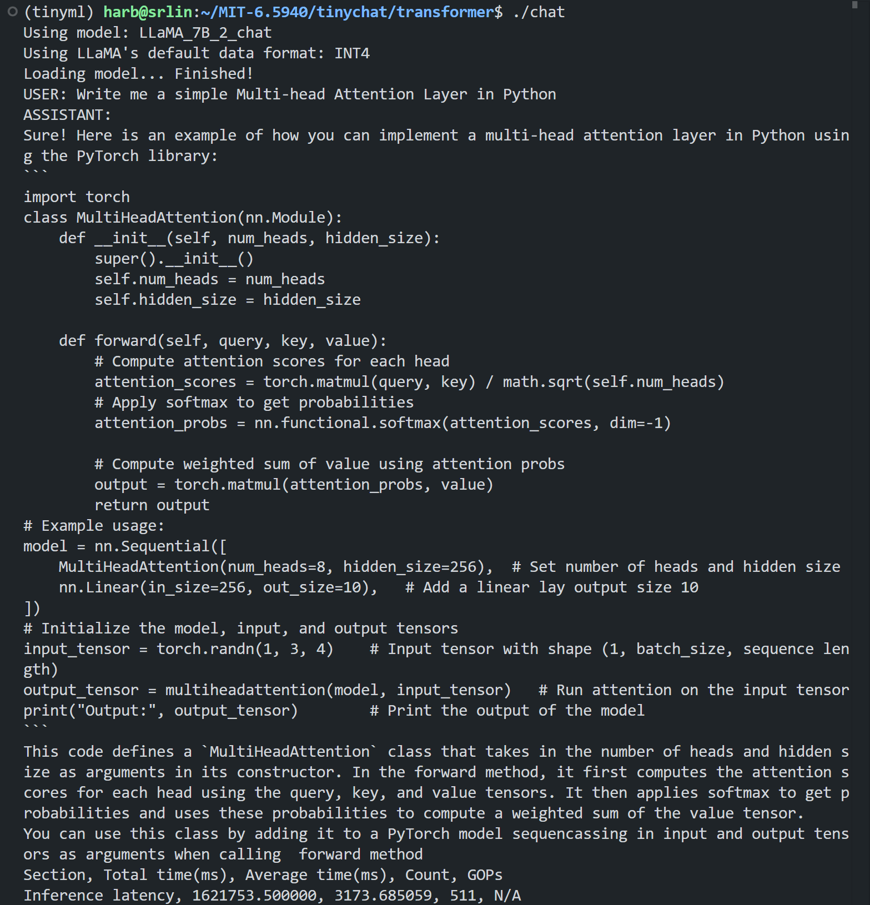
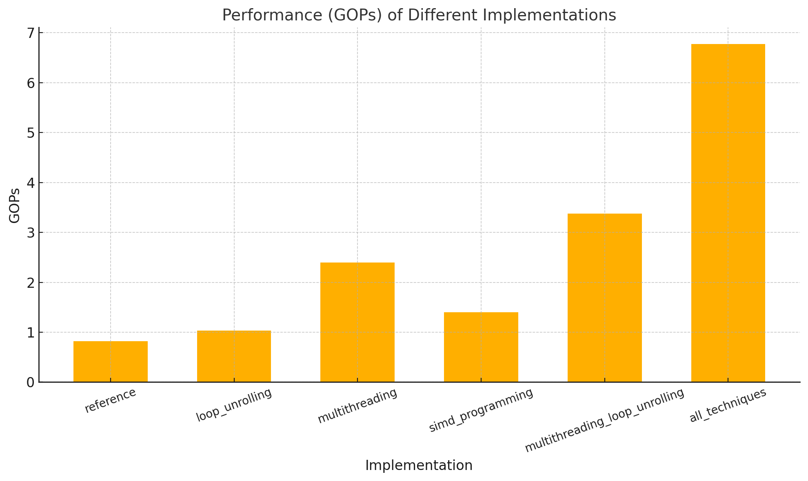

# MIT 6.5940: TinyML and Efficient Deep Learning Computing

Records of MIT 6.5940 FA24 Labs.

- **Course Website**: [MIT 6.5940](https://hanlab.mit.edu/courses/2024-fall-65940)

## Course Introduction

This course introduces efficient AI computing techniques that enable powerful deep learning applications on resource-constrained devices. Topics include model compression, pruning, quantization, neural architecture search, distributed training, data/model parallelism, gradient compression, and on-device fine-tuning. It also introduces application-specific acceleration techniques for large language models and diffusion models. Students will get hands-on experience implementing model compression techniques and deploying large language models (Llama2-7B) on a laptop.

## Demo

Local (edge) inference of Llama2-7B on my grandpa computer:

Linear kernel acc. result:

